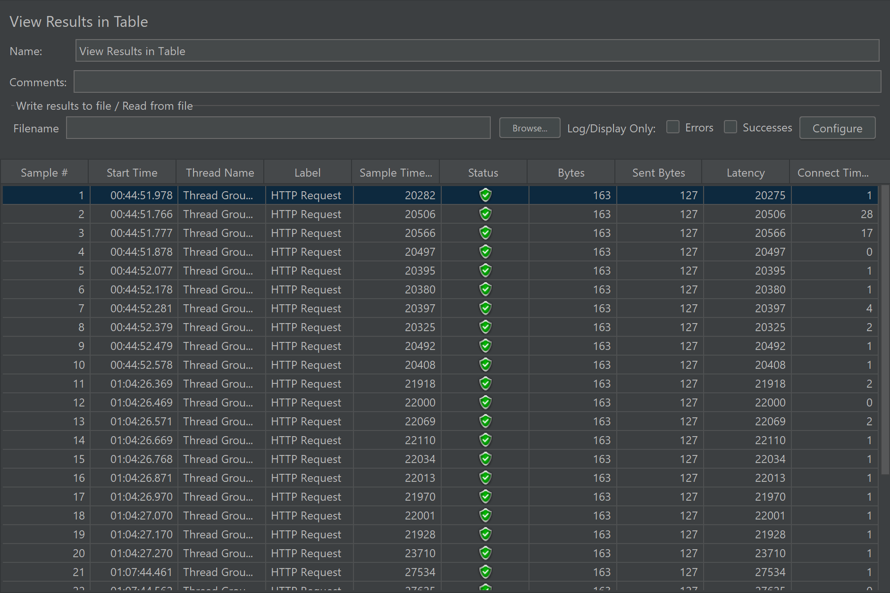
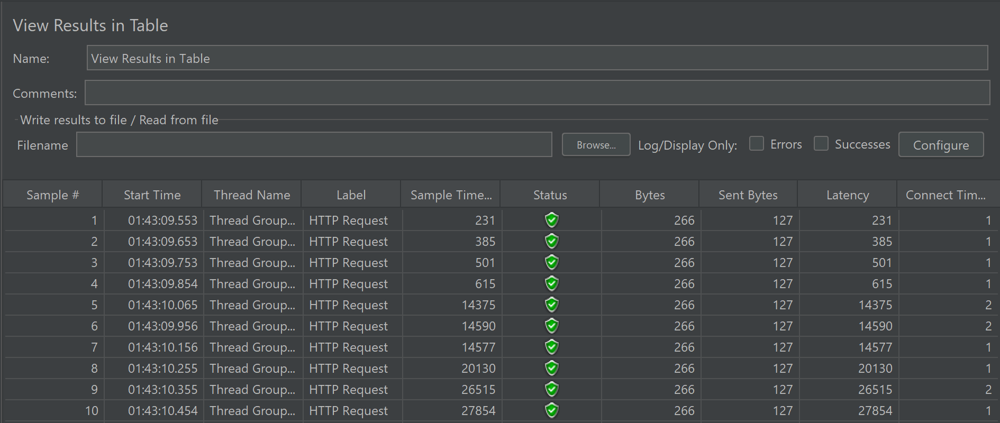
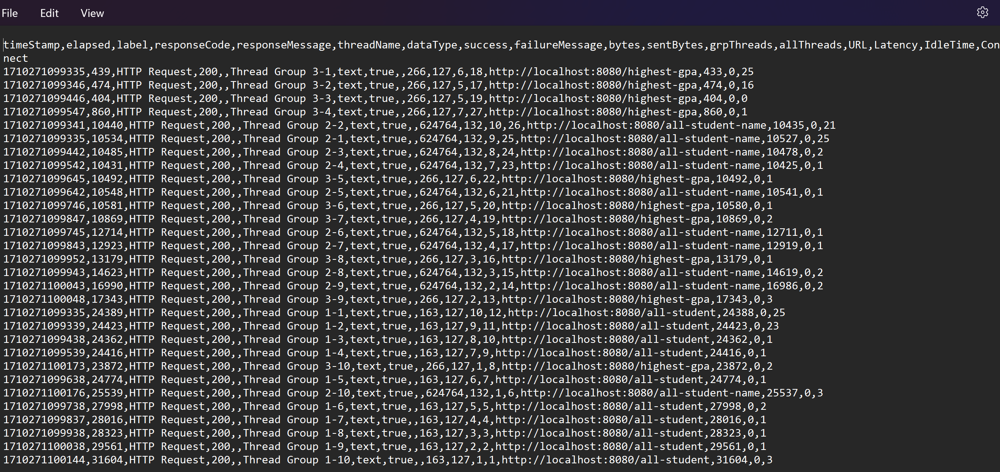
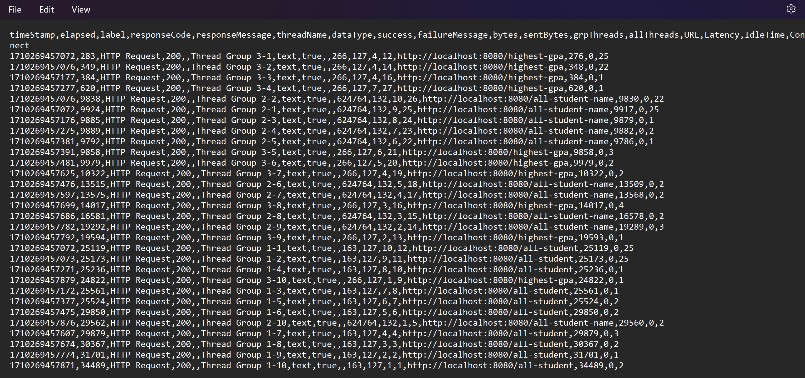

# Modul 5

# Question & Answer

# JMeter Screenshot

## Before Optimization

/all-student

/all-student-name

/highest-gpa

/all-student.jtl

/all-student-name.jtl

/highest-gpa.jtl

## After Optimization

/all-student

/all-student-name

/highest-gpa
