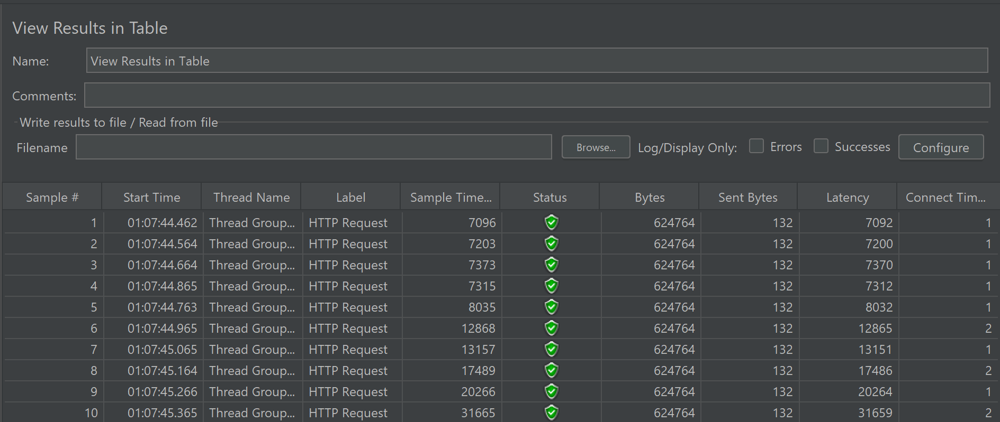

# Modul 5

# Question & Answer

1. What is the difference between the approach of performance testing with JMeter and profiling with IntelliJ Profiler in the context of optimizing application performance?
- JMeter melakukan HTTP test dengan cara mensimulasikan dan akan didapat metrik response time, latency dan sebagainya.
- Intellij Profiler digunakan untuk mencari tahu bottleneck secara cukup spesifik sampai level fungsi-fungsi yang menyebabkan performa aplikasi lambat.
2. How does the profiling process help you in identifying and understanding the weak points in your application?

Proses profiling berguna untuk menemukan bottleneck melalui fungsi-fungsi pada aplikasi yang menyebabkan performa aplikasi menjadi lambat. Profiler akan merekam function call dan mengumpulkan data bagian-bagian yang menjadi bottleneck. Informasi yang diperoleh bisa berupa CPU usage, memory allocation, garbage collection activity, dan thread concurrency.

3. Do you think IntelliJ Profiler is effective in assisting you to analyze and identify bottlenecks in your application code?

Menurut saya, IntelliJ Profiler sangat efektif dalam menemukan bottleneck. Hal ini dikarenakan result dari IntelliJ Profiler yang memungkinkan kita untuk mengetahui secara spesifik fungsi mana yang memakan banyak waktu. Kita dapat mengetahui juga mana yang bisa kita optimize mana yang tidak.  

4. What are the main challenges you face when conducting performance testing and profiling, and how do you overcome these challenges?

Tantangan yang saya hadapi dalam melakukan profiling adalah:

* Memahami Hasil Profiling, frame chart yang diberikan terlihat sangat kompleks dan susah diliat. Diperlukan banyak waktu dan dugaan-duggan untuk menentukan mana fungsi yang benar bottleneck.
* Melakukan Optimisasi, setelah menemukan bottleneck, problem selanjutnya adalah menentukan apakah fungsi tersebut dapat dioptimize.  

5. What are the main benefits you gain from using IntelliJ Profiler for profiling your application code?

Selain yang sudah disebutkan, IntelliJ adalah IDE yang berarti semua tool profiling sudah tersedia tanpa perlu penginstallan. Hal ini tentu membedakan dengan code editor seperti VS Code. Jadi tidak diperlukan untuk menginstall third party untuk melakukan profiling.

6. How do you handle situations where the results from profiling with Inte	lliJ Profiler are not entirely consistent with findings from performance testing using JMeter?

Saya tidak mengalami hal ini. Namun, jika saya mengalami hal tersebut, hal yang saya lakukan adalah memeriksa semua konfigurasi yang ada. Dari dimulai database, aplikasi, IntelliJ, hingga operating system saya. Jika masih inkonsisten, saya akan mencari tahu penyebabnya melalui google dan kemudian bertanya kepada atasan untuk diselesaikan bersama.

7. What strategies do you implement in optimizing application code after analyzing results from performance testing and profiling? How do you ensure the changes you make do not affect the application's functionality?

Strategi yang saya lakukan dalam melakukan refactoring untuk mempercepat kinerja aplikasi adalah:

1. Membuat test terlebih dahulu untuk memastikan tidak berubahnya fungsionalitas awal
2. Meminimalisir penggunaan high level interface, jika sorting pada database bisa dilakukan, maka proses sorting lebih baik dilakukan di database yang mana lebih low level. 
3. Mencari-cari implementasi yang lebih baik di internet. Konsep seperti string buffer, cache dan sebagainya diciptakan dengan alasan performa. Kita sebagai programmer harus mempunyai pengalaman akan optimisasi seperti ini. 
4. Mengasah skill struktur data dan algoritma. Mungkin saja terdapat kasus dimana kita perlu mengimplementasikan struktur data spesial seperti segment tree, heap, binary search, dynamic programming dan sebagainya dalam mendapatkan solusi optimal. 

# JMeter Screenshot

## Before Optimization

/all-student

/all-student-name

/highest-gpa

/all-student.jtl

/all-student-name.jtl

/highest-gpa.jtl

## After Optimization

/all-student

/all-student-name

/highest-gpa
